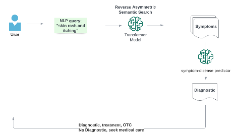

# pediatric_self_diagnosis

Unnecessary visits to ER represent an enormous waste of valuable medical resources, not to mention the economical and societal cost, as well as impact on the well-being of each individual family. 

A prototype built to demonstrate the concept and how different AI components work together to form a more sophisticated system. It is built around two machine learning models, an NLP model that is designed to turn free text input into symptom features. The symptom features are fed into a symptom-disease predictor to get a diagnostic.

